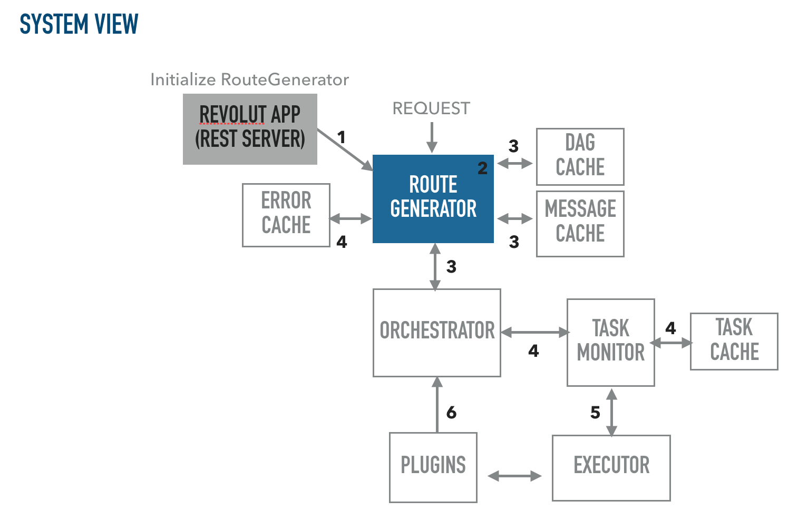
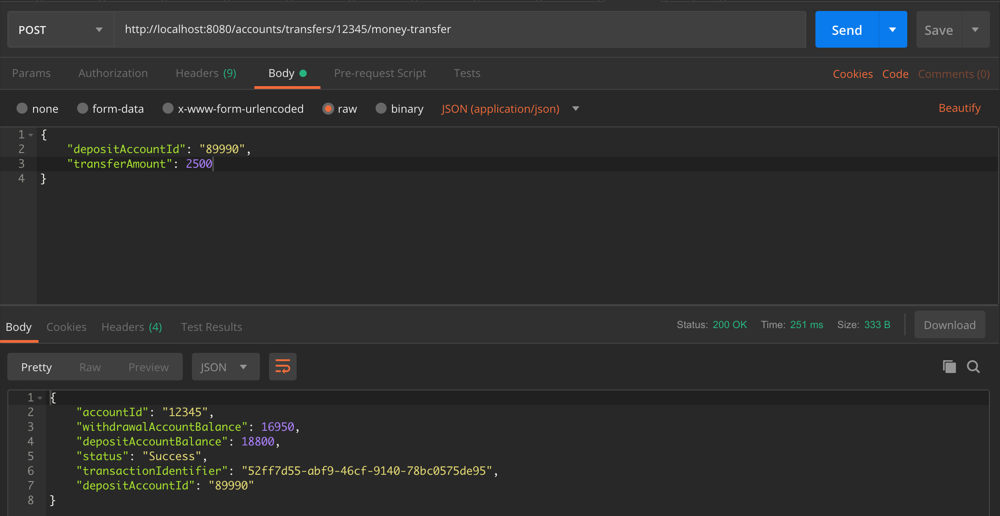
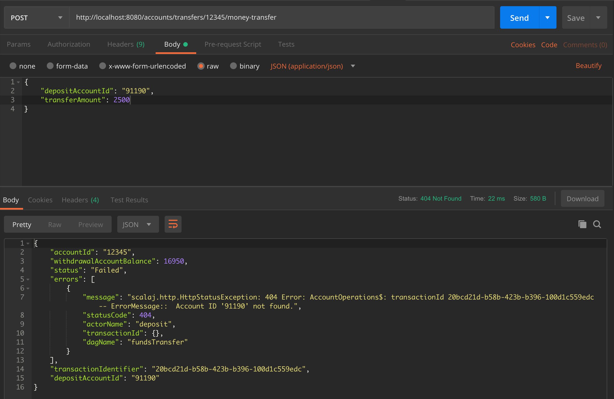
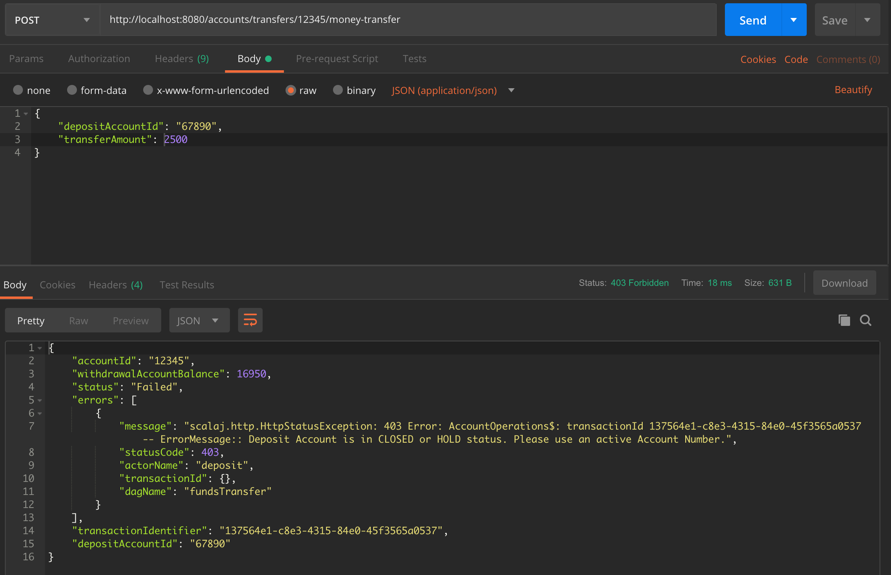
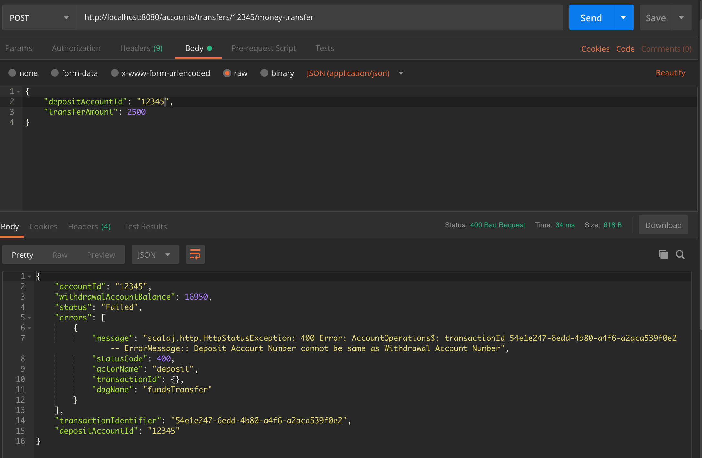

## Money Transfer App

###### Prerequisites
* Scala 12.2 or later
* sbt 1.0.x
* RAM >= 8GB (To run all tests successfully without any JVM issues)
* POSTMAN or cURL

Build the project
-------------
###### Build artifact and publish locally to run the executable
```
sbt assembly publishLocal
```

Run tests
-------------
###### Unit tests with coverage
```
sbt testCoverage
```

Running the App
-------------
```
java -cp core/target/core-assembly-1.0.0-SNAPSHOT.jar \
    -Droute.file=conf/route.json \
    -Dprop.file=conf/money_transfer.conf \
    -Dplugin.lib=plugins/target/plugins-assembly-1.0.0-SNAPSHOT.jar \
    com.revolut.money_transfer.core.app.RevolutApp
```

Input Data
-------------
* The input data (accounts data) that is loaded in memory by API resides in [accounts](https://github.com/mbelsare/money-transfer/tree/master/accounts) directory of repo's parent path. 
* Currently the API loads only 6 records in memory from `accounts_detail.json` for processing.
* The account details that are loaded in memory for testing with their accountStatus and balance are
```
  | customerId | accountId | accountBalance  | accountStatus |
__________________________________________________________________
  | customer1  | 12345     | 19450           | Active        |
  | customer1  | 45321     | 3500            | Active        |
  | customer2  | 77777     | 12000           | Active        |
  | customer3  | 89990     | 16300           | Active        |
  | customer4  | 67890     | 0               | Closed        |
  | customer5  | 11345     | 1520            | Hold          |
__________________________________________________________________
```

Architecture
-------------
###### Assumptions
  - The service is called by multiple services.
  - The API needs to transfer money from one account to another account which is an update to the state of `account_details` table. It is a **POST** request.
   
###### Design approach
  - The API should update the withdrawal account balance and deposit account balance with the the amount provided by client in request body.
  - Since withdrawal & deposit, both operations update the state of DB, the resulting API call is a `POST` request since the client can transfer funds multiple times to the same account.
  - The `POST` operation handles both `withdrawal` and `deposit` in one execution flow(unified way) without having to make 2 separate API calls internally.
  - The service should run for multiple concurrent requests by maintaining the state of each transaction in its own scope
  - Used `Akka` and `Akka HTTP` actor based implementation to solve for concurrency, scalability, distributed & async execution for building high performant applications through use of `message queues` for communication.
  - Applications built on top of `Akka` are multi-actor-based system that allows for configurable scaling of use case loads by routing requests to actors based on their queue sizes.
  - The actors in the `money-transfer` App are configured in the form of `DAG (Directed Acyclic Graph)` through a json file in `conf/` directory
  - The definition & configs for each actor is provided in `conf/money_transfer.conf` file.
  - The app should never call **deposit** functionality/actor in case **withdraw** operation fails. This feature is implemented through a `Skippability` trait that each plugin executes.
__________________________________________
The API endpoint is `/accounts/transfers/:accountId/money-transfer`  

**Body**
  ```
  {
    "depositAccountId": String,
    "transferAmount": Double
  }
  ```
  **accountId** : *Withdrawal account id in URI [String]*<br/>
  **depositAccountId** : *Recipient account id [String]*<br/>
  **transferAmount** : *Amount to transfer [Double]*
  
  **Returns**
  ```
  {
    "accountId": String,
    "depositAccountId": String,
    "withdrawalAccountBalance": Double,
    "depositAccountBalance": Double,
    "status": Boolean,
    "transactionIdentifier": UUID
  }
  ```
__________________________________________
System Overview
---------------


##### Project directory structure & Technical overview
* `accounts` directory contains a JSON file with list of all the accounts to be loaded in memory.
* `conf` directory has 2 files
    1. `route.json`  which defines the API route (endpoint) to be created along with health check and also the DAG which executes actors (Business Logic) as part of the request execution
    2. `money_transfer.conf` defines the config for each actor
* The `money_transfer` API currently runs 3 actors part that form the DAG
    1. `withdraw` actor to withdraw amount from account to transfer to recipient.
    2. `deposit` actor to deposit amount into recipient account.
    3. `db` actor (which just logs currently) to store the current transaction to DB. This is a `log only` actor & establishes no connection to DB. But typically in a web service, you would log each transaction to DB. 
* `commons` module has common functionality code to support core and business logic execution. Some of commons classes are `ExceptionUtils`, `ValidationUtils`
* `plugins` module has all the business logic implemented which runs as part of each request. `AccountsOperation` class/actor has all the core business functionality required to withdraw or deposit funds to an account.
* `core` module is the orchestration layer for the Revolut `money-transfer` app. 
* The `core` module runs a set of actors that invoke the plugins through `reflection` implemented in `Executor` and `ScalaExecution` classes.<hr />
* The data model for the accounts table is provided in `data_model` directory of repo's parent path.
###### Execution flow
- The `RevolutApp` in `core` module is the entrypoint that runs the orchestration to build the API route and initialize business actors.
- Each object in `plugins` implements 2 methods -
    1. `startup` that initializes the actor in `DORMANT` state.
    2. `execute` that runs the actors when invoked through å request. On complete execution, each actor's `STATE` is marked as `FINISHED_SUCCESSFULLY` or `FINISHED_UNSUCCESSFULLY` and the `ROUTE` is marked as `COMPLETE`.
- When a request (GET or POST) is made, the request is handled by `RouteGenerator` actor that uses `Akka directive` to build a route, obtain the `DAG` associated with the route & invoke the plugins defined in the DAG to execute the DAG/business logic.
- Each request is assigned a unique id `UUID` by `RouteGenerator` during its entire execution that is added to the `argsMap` to use by `Plugins`.
- The co-ordination between business actor/plugin execution is handled by `Orchestrator`, `Executor`, `TaskMonitor` and `TransactionMonitor` actors.
- The `Scheduler` actor just initializes (warms up) all the orchestration actors & calls the `startup` method on plugins.
- Each plugin implements the `Skippability` trait to Skip for execution of a functionality if a certain event occurs. For example, if `withdraw` operation fails, `deposit` actor should never be executed. Adding `Skippability` to actor config in `route.json` demonstrates that behavior. If `withdrawFlag` is *false*, the `deposit` operation is automatically skipped and the *skip operation* is logged to console/logs. 
- Caches have been implemented for all the actors to prevent reloading of configs, maintain actor states and avoid concurrency issues between multiple requests.
- Caches implement Map that store `transactionId` of each request as their key & object details as value. This ensures each request is uniquely identified and cached by a `UUID` to avoid concurrency issues between calls.
- Unit tests exist for all the classes, actors, caches and plugins.
- To demonstrate the correct behavior of API, run the `RouteGeneratorTests` which executes a DAG flow for different scenario of requests. The `RouteGeneratorTests` run a series of test API calls to validate multiple failure and success scenarios for the API. <hr />
* In order to call the `/money-transfer` API, run the app (as given in the steps above).
* Validate the API is up and running by calling the `/health-check`.
* cURL the endpoint using POSTMAN App or using cURL command.
* The logs for each request are populated in the terminal when the app boots up.
* Sample execution scenarios are provided in the section below.
 
cURL'ing the API
-------------
###### Health check endpoint configured
```
curl -X GET http://localhost:8080/accounts/transfers/money-transfer/health-check \
    -H 'Accept: application/json;v=1' \
```

###### Valid Request
```
curl -X POST \
  http://localhost:8080/accounts/transfers/12345/money-transfer \
  -H 'Accept: application/json;v=1' \
  -H 'Content-Type: application/json' \
  -d '{
	"depositAccountId": "89990",
	"transferAmount": 2500
}'
```

###### Valid response - 200 OK
```
{
    "accountId": "12345",
    "withdrawalAccountBalance": 16950,
    "depositAccountBalance": 18800,
    "status": "Success",
    "transactionIdentifier": "52ff7d55-abf9-46cf-9140-78bc0575de95",
    "depositAccountId": "89990"
}
```

###### Withdrawal account equals Deposit account 
```
curl -X POST \
  http://localhost:8080/accounts/transfers/12345/money-transfer \
  -H 'Accept: application/json;v=1' \
  -H 'Content-Type: application/json' \
  -d '{
	"depositAccountId": "12345",
	"transferAmount": 2500
}''
```

###### Failed response with amount rolled back to withdrawal account - 400 (Bad Request)
```
{
    "accountId": "12345",
    "withdrawalAccountBalance": 16950,
    "status": "Failed",
    "errors": [
        {
            "message": "scalaj.http.HttpStatusException: 400 Error: AccountOperations$: transactionId 54e1e247-6edd-4b80-a4f6-a2aca539f0e2 -- ErrorMessage:: Deposit Account Number cannot be same as Withdrawal Account Number",
            "statusCode": 400,
            "actorName": "deposit",
            "transactionId": {},
            "dagName": "fundsTransfer"
        }
    ],
    "transactionIdentifier": "54e1e247-6edd-4b80-a4f6-a2aca539f0e2",
    "depositAccountId": "12345"
}
```

###### Withdraw amount negative request
```
curl -X POST \
  http://localhost:8080/accounts/transfers/12345/money-transfer \
  -H 'Accept: application/json;v=1' \
  -H 'Content-Type: application/json' \
  -d '{
	"depositAccountId": "89990",
	"transferAmount": -2500
}'
```

###### Failed response with amount rolled back to withdrawal account - 400 (Bad Request)
```
{
    "accountId": "12345",
    "status": "Failed",
    "errors": [
        {
            "message": "scalaj.http.HttpStatusException: 400 Error: AccountOperations$: transactionId 2110568c-2e23-41c2-847e-9d5452c91e74 -- ErrorMessage:: Invalid request. Withdrawal amount cannot be negative.",
            "statusCode": 400,
            "actorName": "withdraw",
            "transactionId": {},
            "dagName": "fundsTransfer"
        }
    ],
    "transactionIdentifier": "2110568c-2e23-41c2-847e-9d5452c91e74",
    "depositAccountId": "89990"
}
```

###### Deposit account in CLOSED state request
```
curl -X POST \
  http://localhost:8080/accounts/transfers/12345/money-transfer \
  -H 'Accept: application/json;v=1' \
  -H 'Content-Type: application/json' \
  -d '{
	"depositAccountId": "67890",
	"transferAmount": 2500
}'

```
###### Failed response with amount rolled back to withdrawal account - 403 (Forbidden)
```
{
    "accountId": "12345",
    "withdrawalAccountBalance": 16950,
    "status": "Failed",
    "errors": [
        {
            "message": "scalaj.http.HttpStatusException: 403 Error: AccountOperations$: transactionId 137564e1-c8e3-4315-84e0-45f3565a0537 -- ErrorMessage:: Deposit Account is in CLOSED or HOLD status. Please use an active Account Number.",
            "statusCode": 403,
            "actorName": "deposit",
            "transactionId": {},
            "dagName": "fundsTransfer"
        }
    ],
    "transactionIdentifier": "137564e1-c8e3-4315-84e0-45f3565a0537",
    "depositAccountId": "67890"
}
```

###### Deposit Account Id Not Found request
```
curl -X POST \
  http://localhost:8080/accounts/transfers/12345/money-transfer \
  -H 'Accept: application/json;v=1' \
  -H 'Content-Type: application/json' \
  -d '{
	"depositAccountId": "91190",
	"transferAmount": 2500
}'
```

###### Failed response with amount rolled back to withdrawal account - 404 (NotFound)
```
{
    "accountId": "12345",
    "withdrawalAccountBalance": 16950,
    "status": "Failed",
    "errors": [
        {
            "message": "scalaj.http.HttpStatusException: 404 Error: AccountOperations$: transactionId 20bcd21d-b58b-423b-b396-100d1c559edc -- ErrorMessage::  Account ID '91190' not found.",
            "statusCode": 404,
            "actorName": "deposit",
            "transactionId": {},
            "dagName": "fundsTransfer"
        }
    ],
    "transactionIdentifier": "20bcd21d-b58b-423b-b396-100d1c559edc",
    "depositAccountId": "91190"
}
```

Execution images
-------------
###### AccountId 1 to AccountId 2 :: `SUCCESS`


###### AccountId 1 to Non existing AccountId :: `404 (NotFound)`


###### AccountId 1 to Closed AccountId :: `403 (Forbidden)`


###### AccountId 1 to AccountId 1 :: `400 (Bad Request)`

